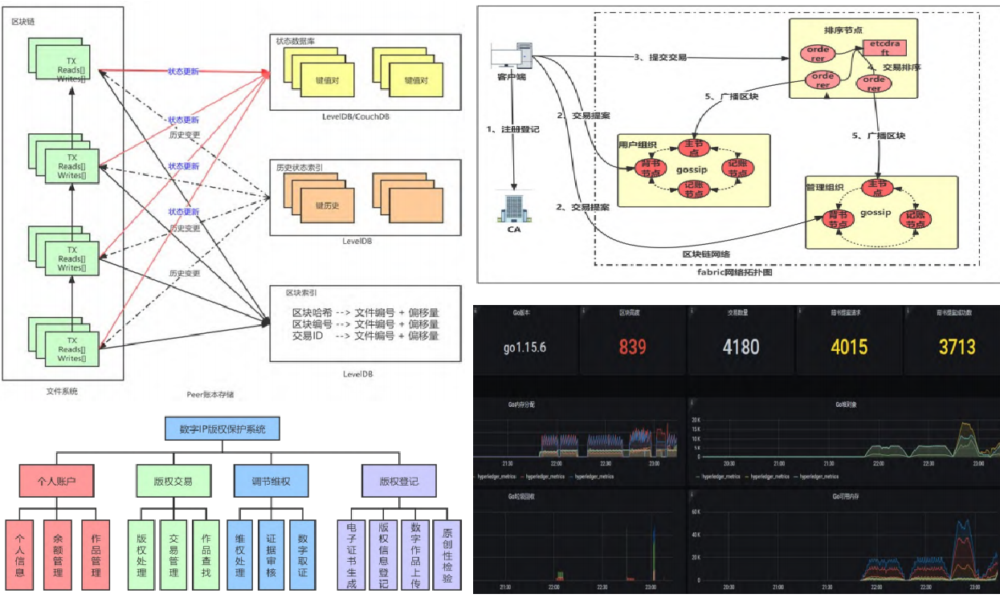
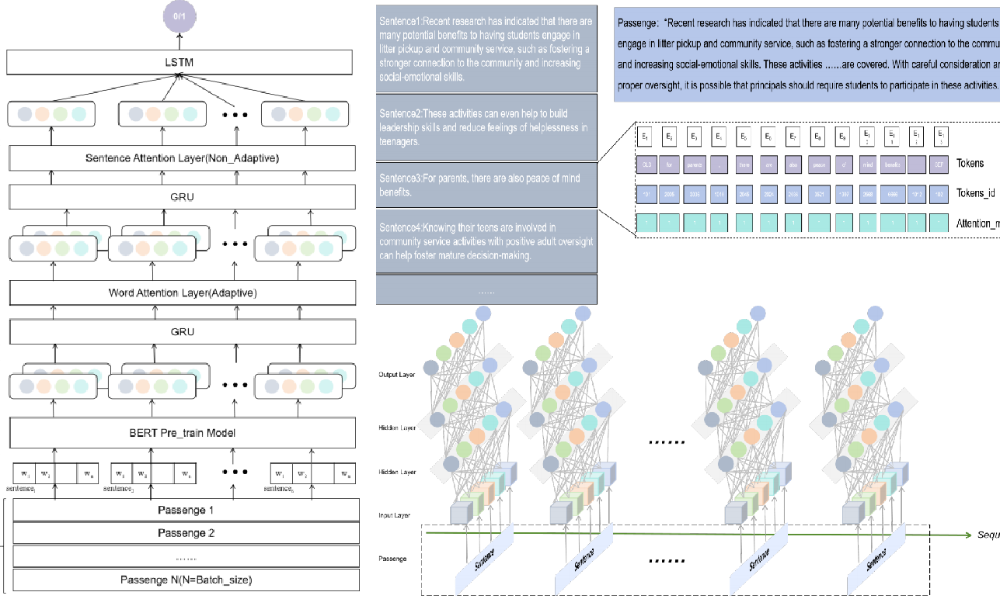








# 👋 Welcome! 

I am now an undergraduate student at [Jinan University](https://www.jnu.edu.cn/main.htm), Guangdong, China. At the same time, I have passed the interview with the [Hong Kong University of Science and Technology(Guangzhou)](https://www.hkust-gz.edu.cn/zh/)'s Red Bird Mphil committee and will pursue an Mphil degree at HKUST(GZ) starting in September 2025. 

Fortunately, I was selected into the excellent student training program during my undergraduate studies, which only 1% of the whole university were selected. Then, I received a series of scientific research training under the guidance of [Dr.Qingliang Chen](https://faculty.jnu.edu.cn/xxkxjsxy/cql2/list.htm), [Dr.Ke Wang](https://faculty.jnu.edu.cn/xxkxjsxy/wk/list.htm) and [Dr.Lin Cui](https://faculty.jnu.edu.cn/xxkxjsxy/cl6/list.htm).

From *2022* to *2024*, I participated in the Guangdong Provincial Key Field R&D Program-"Research and Application of Key Technologies for Digital Publishing Platform Based on Artificial Intelligence(Project No.:2022B0101010005)."

During my undergraduate studies, I also participated as the person in charge in the National College Students' Innovation and Entrepreneurship Training Program (Finally received *Excellent results*), the China College Students' "Internet +" Competition, the Challenge Cup and other projects.

My research interest includes *natural language processing* and *Large Language Models*. **I look forward to exploring more possibilities of artificial intelligence in our daily life and making my own achievements.**

You can find my CV here: [Jiepeng Zhou's Curriculum Vitae](../assets/Curriculum_Vitae.pdf).

# 🔥 News
- *2024.08*: &nbsp; An invention patent on the BHL model was accepted (The first author). 
- *2024.07*: &nbsp; Two software copyrights were authorized (Independent first author).
- *2024.04*: &nbsp; A utility model patent was accepted (The third author).
- *2023.02*: &nbsp; 🎉🎉 My first Journal Paper on digital IP copyright protection technology under the alliance blockchain environment was Accepted (The third author).

# 📝 Publications 

- 🎓**Published**
  

Journal Paper

[Digital IP copyright protection technology under the alliance blockchain environment](https://journal.cuc.edu.cn/mediaCCUploadFiles/202304080248322a120180d76b44e3b7fcbcdcac3974d5.pdf)

Wen Yinhua, Zheng Hanghan, **Zhou Jiepeng**, Feng Zhengjie, Wen Jianwei, Lin Jie, Wang Ke, Lin Weiguo

[**Project**](https://journal.cuc.edu.cn/mediaCCUploadFiles/202304080248322a120180d76b44e3b7fcbcdcac3974d5.pdf) <strong></strong>
- Verified the feasibility of using blockchain technology for copyright protection.
- Develop a corresponding platform to implement the process of blockchain-marked copyright.

- 🎓**Under Review**
  

Journal Paper

[A deep authentication technology for distinguishing Generated Text from Human Text based on the BHL model]()

**Zhou Jiepeng**, Zhuoxing Li, Zhuoye Yang, Bo Yang

[**Project**]() <strong></strong>
- Train a large model capable of distinguishing generated text from human text by Bert and LSTM combined with the Attention mechanism.
- The BHL model was compared with models such as TextCNN, TextRCNN, and BiLSTM, and an ablation experiment was performed with Bert-Han to verify the model performance.
- The model achieved an accuracy of over 97% on the discrimination task.

Journal Paper

[Digital IP copyright protection technology under the alliance blockchain environment](https://journal.cuc.edu.cn/mediaCCUploadFiles/202304080248322a120180d76b44e3b7fcbcdcac3974d5.pdf)

Wen Yinhua, Zheng Hanghan, **Zhou Jiepeng**, Feng Zhengjie, Wen Jianwei, Lin Jie, Wang Ke, Lin Weiguo

[**Project**](https://journal.cuc.edu.cn/mediaCCUploadFiles/202304080248322a120180d76b44e3b7fcbcdcac3974d5.pdf) <strong></strong>
- Lorem ipsum dolor sit amet, consectetur adipiscing elit. Vivamus ornare aliquet ipsum, ac tempus justo dapibus sit amet. 

# 🎖 Honors and Awards
- *2024.12* The only one nominated as Jinan Star in the whole College.  (Top 1%)
- *2024.12* Outstanding undergraduate student at the University Level. (Top 1%)
- *2024.10* National Scholarship. (Top 1%)
- *2023.12* National Encouragement Scholarship. (Top 5%)
- *2023.12* Outstanding Student of Jinan University.
- *2022.12* National Encouragement Scholarship. (Top 5%)
- *2022.12* Excellent student backbone of Jinan University.

# 📖 Educations
- *2021.09 - 2025.06(Expected)*, Bachelor of Engineering in Network Engineering, Department of Computer Science, Jinan University, Guangdong, China.
  - Supervised by [Dr. Qingliang Chen](https://faculty.jnu.edu.cn/xxkxjsxy/cql2/list.htm)
- *2018.09 - 2021.06*, Liudu Middle School, Shantou, Guangdong, China. 

# 💬 Competitions
- *2024.05*, Meritorious Mention, Mathematical Contest in Modeling for American College Students (MCM). 
- *2023.05*, Honorable Mention, Mathematical Contest in Modeling for American College Students (ICM).
- *2023.12*, 2nd Prize, The National College Mathematics Competition.
- *2023.12*, 3rd Prize, The National College Student Software Testing Competition.
- *2023.11*, 3rd Prize, The Guangdong-HongKong-Macao Greater Bay Area Financial Mathematical Modeling Competition.
- *2022.12*, 3rd Prize, The Asia-Pacific Undergraduate Mathematical Modeling Contest

# 💻 Internships
- *2022.05 - 2024.05*, The Guangdong Provincial Key Field R&D Program, Guangdong, China

  ------

  <i>I know I am not the perfect one, yet aspire to chase the world and achieve greatness@Jiepeng Zhou</i>

