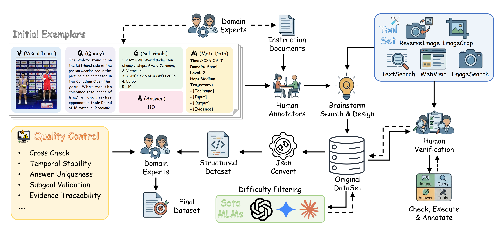
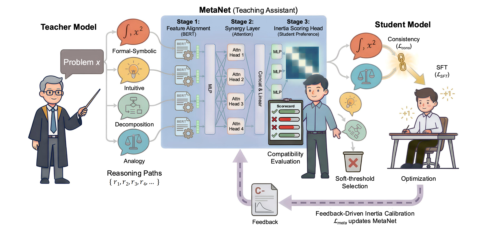
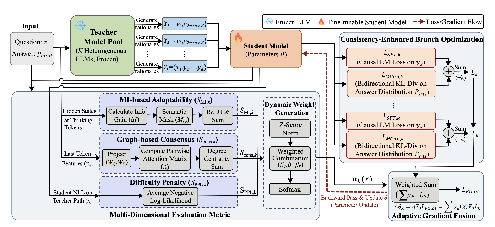
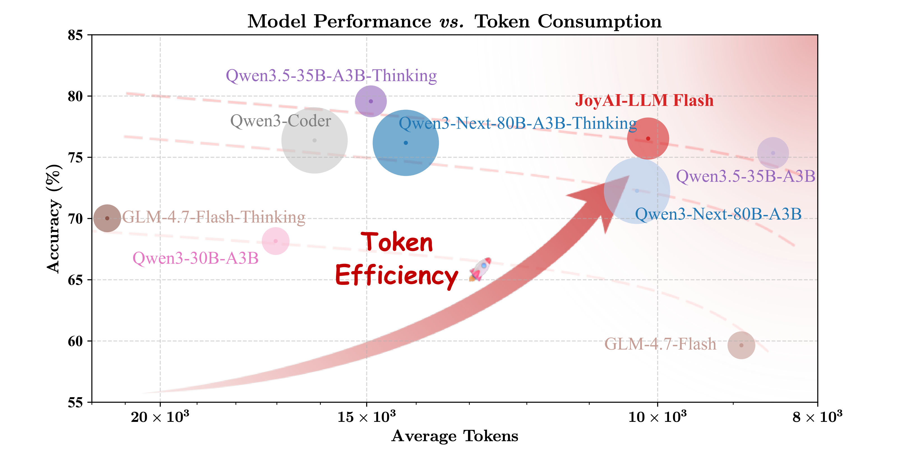

# 📝 Publications

## Pinned Publications

  <article class="pub-card">
    

      
    

    

      <h3 class="pub-card__title">
        <a target="_blank" rel="noopener">
          BrowseComp-V3: A Visual, Vertical, and Verifiable Benchmark for Multimodal Browsing Agents
        </a>
      </h3>
      

        Huanyao Zhang, <strong>Jiepeng Zhou</strong>, Bo Li, Bowen Zhou, Yanzhe Shan... +20
        Arxiv Preprint
      

      

        A visual web browsing benchmark for multimodal Agents, spanning 5 vertical domains with cross-page aggregation and multi-hop reasoning tasks to evaluate visual grounding capabilities.
      

      

        <a class="pub-btn" href="https://arxiv.org/abs/2602.12876" target="_blank" rel="noopener">Paper</a>
        <a class="pub-btn pub-btn--ghost" href="{{ site.baseurl }}/detail/bcv3-en/" rel="noopener">Detail</a>
      

    

  </article>

  <article class="pub-card">
    

      
    

    

      <h3 class="pub-card__title">
        MIND: From Passive Mimicry to Active Reasoning through Capability-Aware Multi-Perspective CoT Distillation
      </h3>
      

        Jin Cui*, Jiaqi Guo*, <strong>Jiepeng Zhou*</strong>, Ruixuan Yang, Jiayi Lu... +4
        ACL 2026, CCF A
      

      

        A capability-aware distillation framework introducing 8 reasoning perspectives (e.g., Socratic) with dynamic CoT path selection, surpassing larger models in reasoning and cross-domain generalization at 7B scale.
      

      

        <a class="pub-btn" href="https://arxiv.org/abs/2601.03717" target="_blank" rel="noopener">Paper</a>
        <a class="pub-btn pub-btn--ghost" href="{{ site.baseurl }}/detail/mind-en/" rel="noopener">Detail</a>
      

    

  </article>

  <article class="pub-card">
    

      
    

    

      <h3 class="pub-card__title">
        “The Whole Is Greater Than the Sum of Its Parts”: A Compatibility-Aware Multi-Teacher CoT Distillation Framework
      </h3>
      

        Jin Cui*, Jiaqi Guo*, <strong>Jiepeng Zhou*</strong>, Ruixuan Yang, Jiayi Lu... +4
        Arxiv Preprint
      

      

        A multi-teacher distillation framework that dynamically fuses diverse teacher biases, enabling active reasoning internalization in lightweight models under minimal data.
      

      

        <a class="pub-btn" href="https://arxiv.org/abs/2601.13992" target="_blank" rel="noopener">Paper</a>
        <a class="pub-btn pub-btn--ghost" href="{{ site.baseurl }}/detail/compact-en/" rel="noopener">Detail</a>
      

    

  </article>

  <article class="pub-card">
    

      
    

    

      <h3 class="pub-card__title">
        JoyAI-LLM Flash: Advancing Mid-Scale LLMs with Token Efficiency
      </h3>
      

        Chao Xue, Xiaodong He,... +70... <strong>Jiepeng Zhou</strong>,... +9
        Arxiv Preprint
      

      

        A reinforcement learning algorithm enabling multi-scale policy optimization with stable thinking-mode switching, achieving superior token efficiency across comprehensive benchmarks.
      

      

        <a class="pub-btn" href="https://arxiv.org/abs/2604.03044" target="_blank" rel="noopener">Paper</a>
      

    

  </article>

  

    <h2 style="margin-top:1.5rem;">Patents & Copyrights</h2>
    

      
<strong>BHL: A Method for Identifying Generative Long Text</strong> — First Author [Invention Patent] (Granted, Patent No: ZL202410848653.9) Utilizing Hierarchy-Attention mechanism to distinguish AI-generated long text from human-written text.

    

    

      
<strong>Hospice Care Platform Based on Front-End and Back-End Separation</strong> — First Author [Software Copyright] (Granted, Registration No: 2024SR0577013) A one-stop hospice care platform built with SpringBoot and Vue3.

    

    

      
<strong>WordWorld Vocabulary Software</strong> — First Author [Software Copyright] (Granted, Registration No: 2024SR1130897) A personalized vocabulary memorization Windows application built with C#.

    

  

  <button class="kv-view-all" onclick="var list=this.previousElementSibling;var open=list.style.display!=='none';list.style.display=open?'none':'block';this.textContent=open?'View Patents & Copyrights':'Collapse';">View Patents & Copyrights</button>

