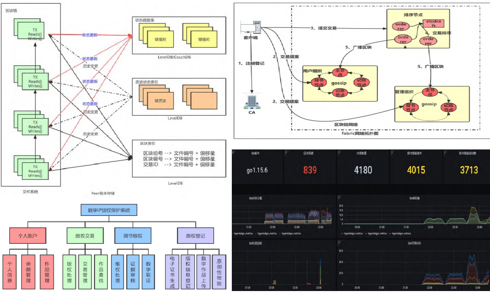
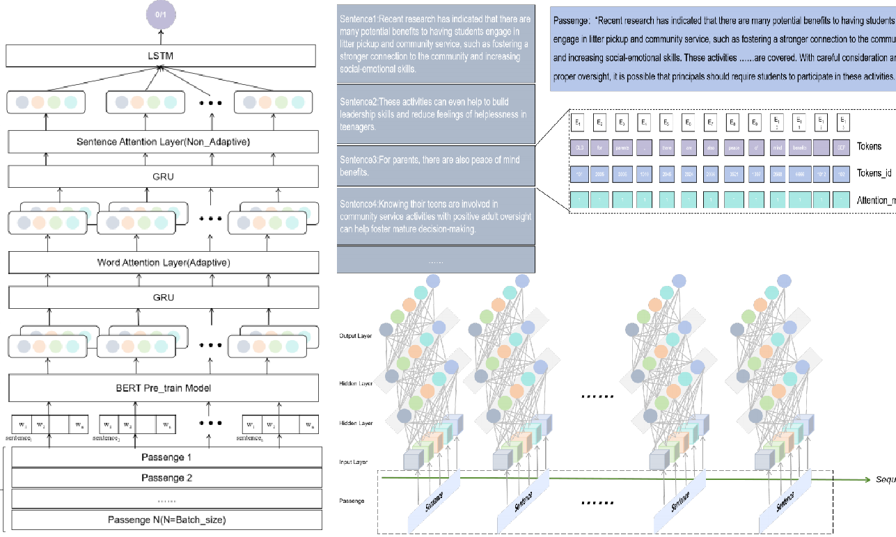
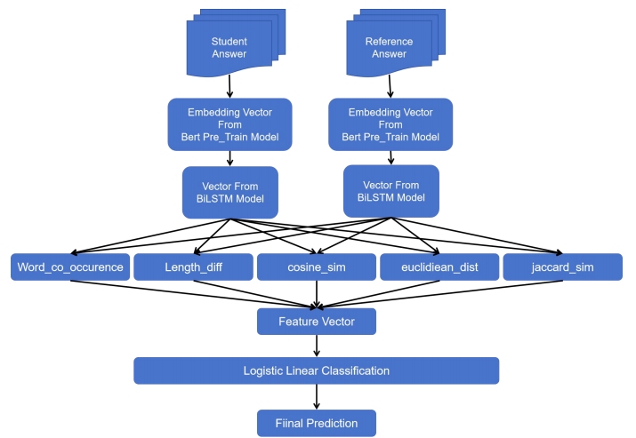

# 📝 Publications

## Pinned Publications

  <article class="pub-card">
    

      
    

    

      <h3 class="pub-card__title">
        <a href="https://journal.cuc.edu.cn/mediaCCUploadFiles/202304080248322a120180d76b44e3b7fcbcdcac3974d5.pdf" target="_blank" rel="noopener">
          Digital IP copyright protection technology under the alliance blockchain environment
        </a>
      </h3>
      

        Wen Yinhua, Zheng Hanghan, <strong>Jiepeng Zhou</strong>, Feng Zhengjie, Wen Jianwei, Lin Jie, Wang Ke, Lin Weiguo
        Journal Paper
      

      

        Verified the feasibility of using blockchain technology for copyright protection, and developed a practical platform to implement the end-to-end process of blockchain-marked copyright.
      

      

        <a class="pub-btn" href="https://journal.cuc.edu.cn/mediaCCUploadFiles/202304080248322a120180d76b44e3b7fcbcdcac3974d5.pdf" target="_blank" rel="noopener">Paper</a>
        <a class="pub-btn pub-btn--ghost" href="{{ site.baseurl }}/detail/blockchain-en/" rel="noopener">Detail</a>
      

    

  </article>

  <article class="pub-card">
    

      
    

    

      <h3 class="pub-card__title">
        A deep authentication technology for distinguishing Generated Text from Human Text based on the BHL model
      </h3>
      

        <strong>Jiepeng Zhou</strong>, Zhuoxing Li, Zhuoye Yang, Bo Yang
        Under review
      

      

        We design a BHL model that combines BERT and LSTM with attention to distinguish generated text from human-written text, with extensive comparison and ablation studies against strong baselines.
      

      

        <a class="pub-btn pub-btn--ghost" href="#" target="_blank" rel="noopener">Paper (coming soon)</a>
        <a class="pub-btn pub-btn--ghost" href="{{ site.baseurl }}/detail/bhl-en/" rel="noopener">Detail</a>
      

    

  </article>

  <article class="pub-card">
    

      
    

    

      <h3 class="pub-card__title">
        Grading Model with BiLSTM and Feature Extraction Manually
      </h3>
      

        <strong>Jiepeng Zhou</strong>, Zhuoye Yang, Zhizhao Li
        Under review
      

      

        A grading model that combines manually designed features with BiLSTM and BERT-style representations to measure text similarity, achieving over 83% accuracy on grading benchmarks.
      

      

        <a class="pub-btn pub-btn--ghost" href="#" target="_blank" rel="noopener">Paper (coming soon)</a>
        <a class="pub-btn pub-btn--ghost" href="{{ site.baseurl }}/detail/grading-en/" rel="noopener">Detail</a>
      

    

  </article>

